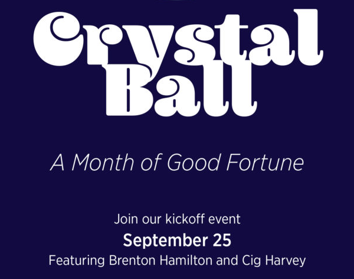

# crystal ball

 ## converted react application to html in order to insert into wordpress

steps for insertion:

1. make an images directory in the same folder as the crystal ball animation file is going to be.   Add the 9 images from the image folder into it.

1. add the code from 'crystal-ball.css' into the css file that applies to the page that the graphic will be on.

1. on the page that you want the animation add these two lines of code at the bottom of the page, right above the closing body ( ```</body>``` ) tag:

    ```
    <script src="https://cdnjs.cloudflare.com/ajax/libs/pixi.js/5.3.3/pixi.min.js"></script>
    <script src="https://cdnjs.cloudflare.com/ajax/libs/pixi.js/5.3.3/pixi.min.js"></script>
        <script>
            const app = new PIXI.Application({
                width: 600,
                height: 600,
                backgroundColor: 0x110b3f, 
                resolution: window.devicePixelRatio || 1,
            });
        
            const blurFilter = new PIXI.filters.BlurFilter();
            let maxBlur = 20,
                blurAmount = maxBlur, 
                pauseCounter = 0, 
                pauseAmount = 2, 
                fadeQ = -0.25, 
                alphaQ = 0.01,
                fadeIn = true,
                pause = false,
                fadeOut = true;
                
            document.getElementById("crystal-ball-animated-graphic").appendChild(app.view);
            const container = new PIXI.Container();
            app.stage.addChild(container);

            const cloudTexture = PIXI.Texture.from('images/clouds.png');
            const clouds = new PIXI.Sprite(cloudTexture);
            clouds.alpha = 0.5;
            clouds.anchor.set(0.5);
            clouds.scale.set(0.5)
            container.addChild(clouds);

            const circleTexture = PIXI.Texture.from('images/circle.png');
            const circle = new PIXI.Sprite(circleTexture);
            circle.anchor.set(0.5);
            container.addChild(circle);

            const coverTexture = PIXI.Texture.from('images/cover.png');
            const cover = new PIXI.Sprite(coverTexture);
            cover.anchor.set(0.5);
            cover.x -= 1;
            container.addChild(cover);

            clouds.mask = circle;

            let graphicTexture1 = PIXI.Texture.from(`images/graphic_1.png`);
            let graphicTexture2 = PIXI.Texture.from(`images/graphic_2.png`);
            let graphicTexture3 = PIXI.Texture.from(`images/graphic_3.png`);
            let graphicTexture4 = PIXI.Texture.from(`images/graphic_4.png`);
            let graphicTexture5 = PIXI.Texture.from(`images/graphic_5.png`);

            let textures = [graphicTexture1, graphicTexture2, graphicTexture3, graphicTexture4, graphicTexture5];
            let textureCounter = 0;

            let graphic = new PIXI.Sprite(textures[0]);
            graphic.anchor.set(0.5);
            graphic.alpha = 0;
            container.addChild(graphic);
            graphic.filters = [blurFilter];

            container.x = app.screen.width / 2;
            container.y = app.screen.height / 2;
            container.pivot.x = container.width / 2;
            container.pivot.y = container.height / 2;
            
            app.ticker.add((delta) => {

                if (fadeIn) {
                    //console.log("fadeIn")
                    blurAmount += fadeQ;
                    if(graphic.alpha < 1) graphic.alpha += alphaQ;
                    if(blurAmount < 0) {
                        fadeIn = false;
                        fadeOut = false;
                        pause = true;
                    }
                    
                } else if (pause) {
                // console.log("pause")
                    pauseCounter += .01;
                    graphic.alpha = 1;
                    if (pauseCounter > pauseAmount) {
                        fadeIn = false;
                        fadeOut = true;
                        pause = false;
                    }
                } else if (fadeOut) {
                    //console.log("fade out")
                    blurAmount -= fadeQ;
                    if (graphic.alpha > 0) graphic.alpha -= alphaQ;
                    if (blurAmount > maxBlur) {
                        
                        pause = false;
                        blurAmount = maxBlur;
                        pauseCounter = 0;
                        textureCounter ++;
                        if (textureCounter > textures.length - 1) {
                            textureCounter = 0;
                        }
                        graphic.texture = textures[textureCounter]
                        fadeIn = true;
                        fadeOut = false;
                    }

                }
                
                blurFilter.blur = (blurAmount);
                let newScale = cosWave(1, 0.25, 0.0005);
                clouds.scale.set(Math.abs(newScale))
                clouds.rotation -= 0.001 * newScale;
            });
            
            function cosWave (startPoint, differential, speed) {
                var currentDate = new Date();
                return startPoint + (Math.cos(currentDate.getTime() * speed) * differential);
            }
        </script>
    ```

1. finally, add the following code to where you want the animation to appear:

    ```
      <div id="crystal-ball-unifier">
        <div id="crystal-ball-animated-graphic"></div>
        
    </div>
    ```